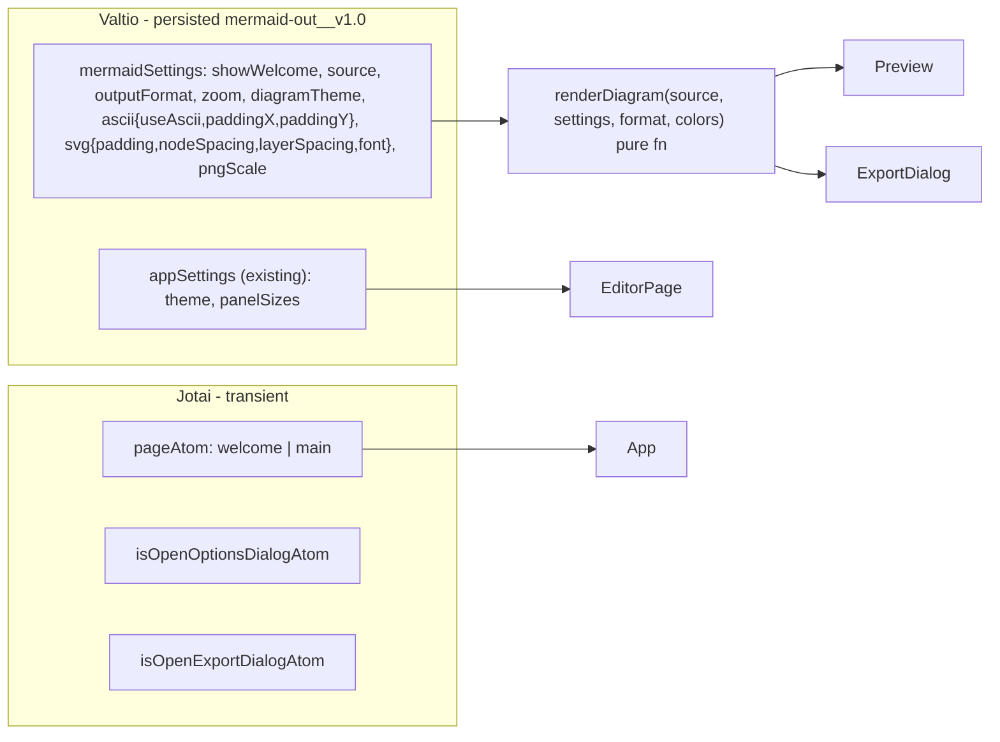

# Mermaid Out — Welcome + Editor/Preview app

## Decisions (confirmed)
- Renderer: `beautiful-mermaid` (SVG via `renderMermaidSVG`, text via `renderMermaidASCII`, `THEMES`), lazily imported (it bundles ELK, ~1.6 MB).
- Editor: `@monaco-editor/react` + self-hosted `monaco-editor` (`esm/vs/editor/editor.api` + `editor.worker?worker`), `monaco-mermaid` for the `mermaid` language and `mermaid`/`mermaid-dark` themes. Loaded via `React.lazy` + `Suspense`, preloaded while the Welcome page is shown.
- State: **Jotai** for transition-sensitive / transient UI (current page, dialog open state) because Valtio's `useSnapshot` uses `useSyncExternalStore` and cannot participate in `startTransition` → no `ViewTransition` animation. **Valtio** for persisted settings (same pattern as `src/store/1-ui-settings.ts`, separate localStorage key `mermaid-out__v1.0`).
- Light/dark: reuse existing `appSettings.theme`, `ButtonThemeToggle`, `isThemeDark`. Nothing new.
- The current app is a template: the content of `src/components/2-main` is replaced (the `xyz-demos` folder is deleted) and `src/components/1-header` is rewritten to the mockup header. New dialogs and stores are added as siblings of the existing ones in `4-dialogs` / `src/store`, each in its own folder/file so the feature code stays grouped.

## New dependencies
`beautiful-mermaid`, `@monaco-editor/react`, `monaco-editor`, `monaco-mermaid`.

## Folder layout
```
src/components/
  0-all/
    0-app.tsx                 REWRITE: Toaster + AllDialogs + ViewTransition page switch (welcome | main)
    1-globals.tsx             ADD OptionsDialog, ExportDialog to AllDialogs
    2-view-transitions.css    NEW: page + shared-logo keyframes, prefers-reduced-motion guard
  1-header/
    index.tsx                 REWRITE: small AppLogo (click -> welcome), options button, ButtonThemeToggle
    8-btn-theme-toggle.tsx    keep
  2-main/                     REPLACED
    index.tsx                 re-exports WelcomePage, EditorPage
    0-app-logo.tsx            shared-element logo (size prop), wrapped in ViewTransition name
    1-welcome-page/           1-welcome-page.tsx (logo, name, Start button, description, "Don't show again" checkbox), reuses Section3_Footer for the "Created by" line
    2-editor-page/
      1-editor-page.tsx       Header + ResizablePanelGroup(editor | preview)
      2-editor/               1-editor-panel.tsx (Suspense), 2-monaco-editor.tsx (lazy chunk), 3-monaco-setup.ts (loader.config, worker, monaco-mermaid init, theme sync)
      3-preview/              1-preview-panel.tsx, 2-preview-toolbar.tsx (SVG|Text toggle, Export button), 3-render-view.tsx (svg/pre + zoom/pan), 4-zoom-controls.tsx, 5-status-bar.tsx
    xyz-demos/                DELETE
  3-footer/                   keep (used by WelcomePage)
  4-dialogs/
    1-options/                0-options-dialog.tsx, 9-types-options.ts (jotai open atom)
    2-export/                 0-export-dialog.tsx (format SVG/Text/PNG, live preview, PNG 1x/2x/4x, Copy + Download), 9-types-export.ts
    8-1-confirmation/, 8-2-login/   keep
src/store/
  1-ui-settings.ts            keep (theme, panelSizes.horizontal reused for editor|preview split); drop expandedSections
  3-mermaid-settings.ts       NEW valtio, persisted under `mermaid-out__v1.0`
  4-ui-atoms.ts               NEW jotai: pageAtom, navigation helper
  5-render.ts                 NEW pure renderDiagram(source, settings, format, colors) + useRenderedDiagram hook
src/utils/
  lazy-modules.ts             import() promises for beautiful-mermaid / monaco (+ preload())
  export-utils.ts             svgToPngBlob, downloadBlob, copyText, copyPngBlob, resolveCssColor
  mermaid-samples.ts          default diagram source
```

## Wiring into existing code
- [src/components/0-all/0-app.tsx](src/components/0-all/0-app.tsx): the `<main>` grid with `Header/MainBody/Section3_Footer` is replaced by the `ViewTransition` page switch; `Toaster` + `AllDialogs` stay.
- [vite.config.ts](vite.config.ts): extend `vendorChunkName` so `monaco-editor`/`@monaco-editor/*`/`monaco-mermaid` → `monaco` chunk and `beautiful-mermaid`/`elkjs`/`entities` → `beautiful-mermaid` chunk. Without this, the catch-all `vendor` group would swallow them and defeat lazy loading.
- [package.json](package.json): add deps.
- [index.html](index.html): title "Mermaid Out".

## State model


## Key behaviours
- **Page transition**: `App` reads `pageAtom`; navigation = `startTransition(() => { addTransitionType('to-main' | 'to-welcome'); setPage(...) })`. Whole page wrapped in `<ViewTransition default="mo-page">`, logo in both pages wrapped in `<ViewTransition name="mo-app-logo" share="mo-logo">`. CSS keyframes in `0-all/2-view-transitions.css`, with `prefers-reduced-motion` opt-out. Header logo must not sit inside the suspending editor boundary (otherwise the shared-element transition is skipped).
- **Startup**: `pageAtom` initial value = `mermaidSettings.showWelcome ? 'welcome' : 'main'`. Checkbox "Don't show it again at start" writes `showWelcome`. Header logo click returns to Welcome.
- **Editor**: Monaco lazy chunk; `beforeMount` runs `initEditor(monaco)` from `monaco-mermaid` once, language `mermaid`, theme `mermaid`/`mermaid-dark` synced to `isThemeDark(appSettings.theme)`. `onChange` → `mermaidSettings.source`. Preview renders a 300 ms debounced source (`useDebounce` from `react-use`). Suspense fallback = existing `BarsLoader` from `src/ui/local-ui`.
- **Preview**: `use(beautifulMermaidPromise)` under Suspense; `useMemo` render (README pattern), try/catch → error shown in status bar. `diagramTheme: 'auto'` passes `bg: 'var(--background)', fg: 'var(--foreground)', transparent: true` so light/dark switches apply live; named theme passes `THEMES[name]`. Text mode renders `<pre className="font-code">`. Zoom (0.1–8, ×1.25 steps, fit = 1) scales SVG width/height (as original) or `pre` font-size; pan button toggles drag-to-scroll. Toolbar: SVG|Text segmented toggle (shadcn `Tabs`), Export button. Status bar: "Rendered in N ms" / error.
- **Export dialog**: format selector (SVG / Text / PNG), preview of exactly what will be exported, PNG scale pills, Copy + Download. In `auto` theme, export re-renders with resolved computed colors (`getComputedStyle(root).getPropertyValue('--background'|'--foreground')`) so the file is self-contained. PNG via `svgToPngBlob` (serialize → Image → canvas). Copy: `clipboard.writeText` for SVG/Text, `ClipboardItem` for PNG. Toast results via existing sonner `Toaster`.
- **Options dialog**: Diagram theme `Select` (auto + 15 `THEMES`), Text output (`Switch` Unicode/ASCII, `Slider` paddingX/Y), SVG layout (`Slider` padding/nodeSpacing/layerSpacing, `Select` font among project fonts), Startup (`Switch` show welcome). Edits write directly to `mermaidSettings`.
- **Panels**: reuse `ResizablePanelGroup/Panel/Handle` with `defaultLayout` + `onLayoutChanged` persisted to the existing `appSettings.panelSizes.horizontal` (pattern from the current `02-test-resizable-panels.tsx`, which is deleted).
- Follow `.cursor/rules/tailwind-class-order.mdc` ordering; run `pnpm check:tw` and `tsc -b` at the end.

## Assumptions
- Main (editor) page has no footer (per mockup); Welcome page renders the existing `Section3_Footer` as its "Created by" line.
- Temporary logo = simple inline SVG mark in `2-main/0-app-logo.tsx`; app name "Mermaid Out".
- `1-header/index.tsx` is rewritten (it is template content too); `8-btn-theme-toggle.tsx`, `3-footer`, `8-1-confirmation`, `8-2-login`, `src/ui/**`, `src/utils/**` are kept as-is.
- `appSettings.expandedSections` (accordion demo state) is removed along with the demo; `showFooter` is left in place.