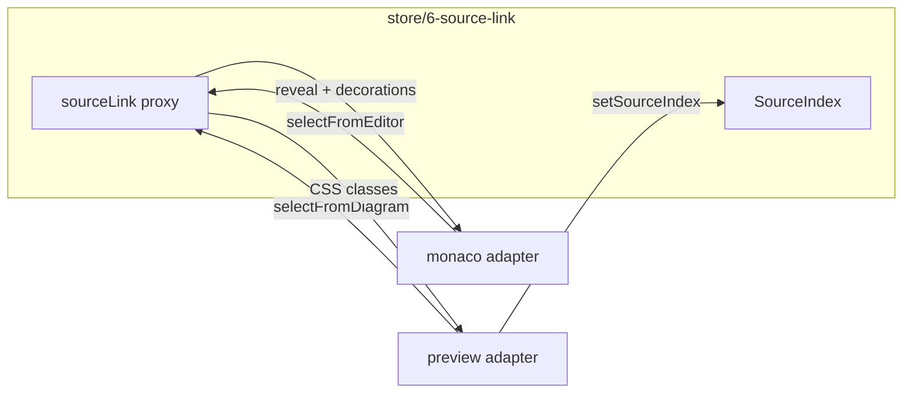

# Bidirectional source ↔ diagram linking

## Decisions

- **State: Valtio**, not Jotai and not React `useState`. Selection is a cross-panel channel written from Monaco callbacks and SVG pointer events — the same role as [`previewStatus`](src/store/5-render.ts). Jotai stays for UI chrome (`pageAtom`, dialogs, `panModeAtom`). Nothing in this feature is persisted.
- **Editor → diagram:** live caret = soft highlight; mouse click in the editor = strong highlight and scroll the matching SVG element into view. Monaco’s cursor event `source` distinguishes `'keyboard'` / `'mouse'` / `'api'`.
- **Diagram → editor:** click a tagged SVG element = strong line decoration and `revealLineInCenter`. Ignore the following caret event (`source === 'api'`).
- **Clickable surface:** every semantic node `beautiful-mermaid` already emits (see catalog below). ASCII and XY-chart (no useful tags) are no-ops.
- **Isolation:** all new logic lives in new folders. Existing files only grow a few hook/prop lines.



## Folder layout

Keep Monaco out of the preview chunk: the preview adapter must never import the monaco adapter (or `monaco-editor`).

- [`src/store/6-source-link/`](src/store/6-source-link/) — types, pure indexer, Valtio proxy + commands
  - `1-types.ts`
  - `2-source-index.ts` — token-safe ID ↔ line map (unit-test this)
  - `3-svg-catalog.ts` — walk a rendered SVG root → tagged elements
  - `4-source-link.ts` — `proxy` + `selectFromEditor` / `selectFromDiagram` / `setSourceIndex` / `clearSourceLink`
  - `index.ts`
- [`src/components/2-main/2-editor-page/4-source-link/monaco/`](src/components/2-main/2-editor-page/4-source-link/monaco/) — editor decorations + caret/click (imported only by the Monaco lazy chunk)
- [`src/components/2-main/2-editor-page/4-source-link/preview/`](src/components/2-main/2-editor-page/4-source-link/preview/) — catalog, click/hit-test, highlight CSS (imported only by [`3-render-view.tsx`](src/components/2-main/2-editor-page/3-preview/3-render-view.tsx))

No shared barrel that re-exports both adapters.

## Store shape

```ts
type LinkIntensity = 'caret' | 'click';
type LinkOrigin = 'editor' | 'diagram';

// sourceLink proxy (not persisted)
{
  keys: string[];           // e.g. "node:A", "edge:A>B", "message:Alice>Bob"
  origin: LinkOrigin | null;
  intensity: LinkIntensity;
  reveal: { line: number; startCol: number; endCol: number } | null;
  index: SourceIndex | null;
}
```

Commands are plain functions (callable from Monaco without hooks):

- `selectFromEditor(keys, intensity)` — no `reveal`
- `selectFromDiagram(keys)` — intensity `'click'`, sets `reveal` to the best source hit (definition line preferred)
- `setSourceIndex(index)` / `clearSourceLink()`

Clear the index and selection when the preview is empty, errors, or switches to ASCII.

## Index: SVG tags × source text

Do **not** use `parseMermaid` line numbers (comments/blank lines are stripped). After each successful SVG inject:

1. Catalog elements with `closest`-friendly selectors:

| Class | Tokens used for matching |
|---|---|
| `.node`, `.subgraph`, `.actor`, `.class-node`, `.entity` | `data-id` |
| `.edge`, `.edge-label`, `.message`, `.class-relationship` | `data-from`, `data-to`, `data-label` |
| `.er-relationship` | `data-entity1`, `data-entity2`, `data-label` |
| `.lifeline`, `.activation` | `data-actor` |
| `.note` | `data-actors` + note text content |
| `.block` | `data-type`, `data-label` |

2. Scan the **live** `mermaidSettings.source` for those tokens with a Mermaid identifier boundary (`A` must not match `A1` or text inside `%%` comments). Rank: shape/participant/class/entity **definition** first, then edge/message lines, then first occurrence.
3. Build `key → hits[]` and `line → keys[]`.

Caret on a line the SVG has not caught up to yet (300 ms debounce) simply highlights nothing until the next catalog. That is acceptable.

## Adapters

**Monaco** ([`2-monaco-editor.tsx`](src/components/2-editor-page/2-editor/2-monaco-editor.tsx) grows `onMount` only):

- Keep the editor instance in a `useRef` (instance handle, not app state).
- `onDidChangeCursorPosition`: ignore `source === 'api'`; otherwise `selectFromEditor(index.lineToKeys[line], source === 'mouse' ? 'click' : 'caret')`.
- When `reveal` is set and `origin === 'diagram'`: `setSelection` + `revealLineInCenter`, then clear `reveal`.
- Decorations: whole-line classes for caret vs click (CSS lives in the monaco folder).

**Preview** ([`3-render-view.tsx`](src/components/2-main/2-editor-page/3-preview/3-render-view.tsx) grows a content ref + hook call):

- After SVG `innerHTML`, catalog + `setSourceIndex`.
- Click / pointerup: `closest` the selectors above. In pan mode, select only if movement `< 4px` so drag-to-scroll still works (listen on the same outer div that already hosts [`usePanToScroll`](src/components/2-main/2-editor-page/3-preview/3-render-view.tsx)).
- Thin connectors are hard to hit: after catalog, add a transparent wider sibling stroke (`stroke-width: 12`) that copies the same `data-*` and class.
- Apply `is-source-link-caret` / `is-source-link-click` on matching elements. Highlight CSS in the preview folder targets both `<g>` children and raw `polyline`/`line`/`rect`. On editor `'click'`, `scrollIntoView` the first match (account for CSS `zoom` on the content wrapper).
- `cursor: pointer` on tagged elements when not panning.

## Out of scope

- Forking / wrapping `beautiful-mermaid` parsers for true source maps
- ASCII hit-testing
- Persisting selection
- A settings toggle (can add later)

## Verification

Exercise in the running preview (`p preview` on port 3000): flowchart sample (node + edge both ways, `A` vs a longer id), sequence (actor, message, note, lifeline), class and ER, caret-move vs click intensity, pan-mode click vs drag, ASCII format shows no linking, typing a new node highlights only after the debounced re-render.
