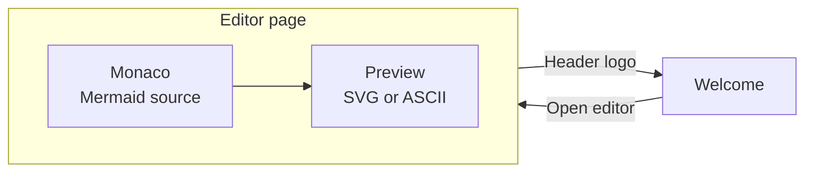
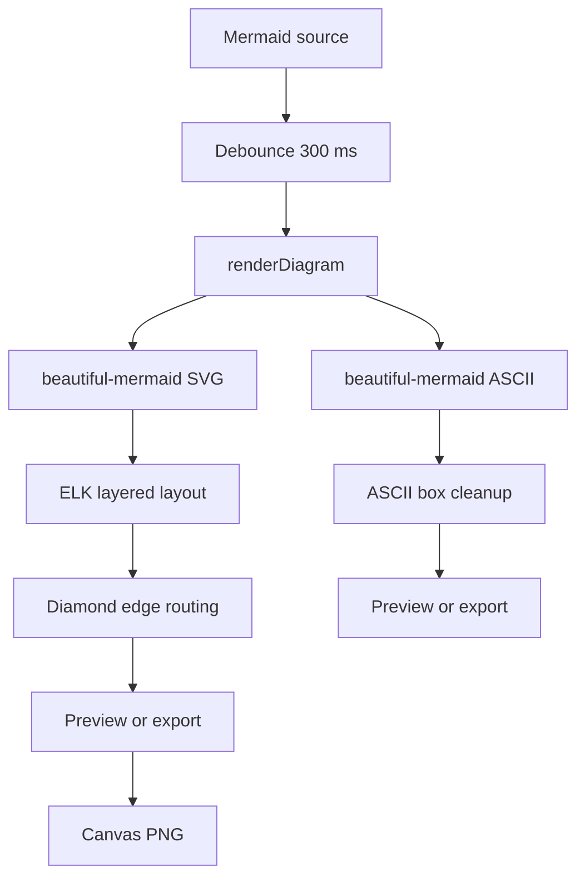
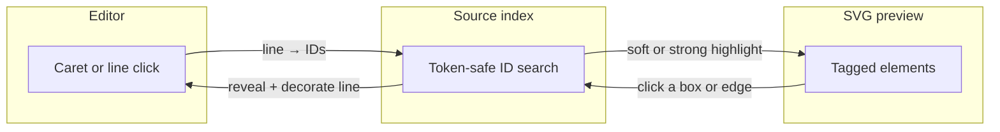

# Mermaid Out

A React editor for [Mermaid](https://mermaid.js.org/) diagrams: type source on the left, see a live SVG or ASCII rendering on the right, then copy or export the result.

Inspired by the [beautiful-mermaid](https://github.com/lukilabs/beautiful-mermaid) live editor, rebuilt here with a fuller UI, Monaco, and bidirectional source ↔ diagram linking.

**[Live demo](https://maxzz.github.io/mermaid-out/)** · **[Source](https://github.com/maxzz/mermaid-out)**

## Table of contents

- [What this project is](#what-this-project-is)
- [How it works](#how-it-works)
- [How to build the project](#how-to-build-the-project)
- [Projects and reading on rendering](#projects-and-reading-on-rendering)

## What this project is

Mermaid Out is a browser app. You write Mermaid text in a lazily loaded [Monaco](https://github.com/microsoft/monaco-editor) editor. A 300 ms debounce later, [beautiful-mermaid](https://github.com/lukilabs/beautiful-mermaid) lays the graph out with [ELK](https://eclipse.dev/elk/) and draws either SVG or Unicode/ASCII text. The preview and export paths share one pure `renderDiagram()` function.

A welcome screen introduces the app, then React 19 `<ViewTransition>` morphs the logo into the editor header. The main page is a persisted split: editor | preview.

```
┌──────────────────────────────────────────────────────────┐
│  [logo] Mermaid Out                      Options  Theme  │
├────────────────────────────┬─────────────────────────────┤
│ Editor                     │ Preview          SVG | Text │
│ samples · ELK layout knobs │ copy · theme · export       │
│                            │                             │
│  graph TD                  │      ┌──────┐               │
│      A[Start] --> B{?}     │      │Start │               │
│      B -->|Yes| C          │      └──┬───┘               │
│                            │         ▼                   │
│  (click a box  ↔  jump     │      ┌──────┐               │
│   to the matching line)    │      │  ?   │               │
│                            │      └──────┘               │
│                            │  zoom / pan / fit           │
│                            ├─────────────────────────────┤
│                            │ OK · Rendered in 12 ms      │
└────────────────────────────┴─────────────────────────────┘
```

**What you can do**

- Edit flowcharts, sequence, state, class, ER, and XY charts with Mermaid syntax highlighting
- Preview as SVG or as Unicode / pure ASCII text
- Click a node, edge, actor, class, or entity in the SVG and jump to the source line — and the reverse, as the caret moves
- Zoom, pan, and fit the preview; pick a diagram theme (or follow the app light/dark mode)
- Tune SVG spacing, font, and ELK layered-layout options; tune ASCII padding and box style
- Copy the current output, or export SVG, PNG (1× / 2× / 4×), or text, with colors flattened so the file stands alone
- Skip the welcome page on later visits; settings persist in `localStorage`

The renderer is not the official `mermaid` package. beautiful-mermaid covers six diagram types, renders synchronously (so the preview can use `useMemo` with no flash), and is loaded in its own chunk so the first paint stays small. Monaco is self-hosted (no CDN) and only fetched when the editor page is about to open.

## How it works

The three diagrams below are the shape of the app: screens, render pipeline, and the source ↔ diagram link.

### Screens



Page switches run inside `startTransition` with `addTransitionType`, so `<ViewTransition>` can animate. Jotai holds that page state: Valtio snapshots use `useSyncExternalStore` and would skip the animation. Persisted diagram settings still live in Valtio (`mermaidSettings`).

### Render pipeline



`renderDiagram()` never throws: errors become a status-bar message. SVG export can inline `var()` / `color-mix()` / `oklch()` as sRGB hex so Illustrator and other viewers do not fall back to black. PNG is the SVG drawn onto a canvas at the chosen scale. A Vite plugin rewrites the published beautiful-mermaid bundle so this app’s ELK knobs (cycle breaking, node placement, model order, merge edges) actually reach the layout engine.

### Source ↔ diagram linking



beautiful-mermaid already stamps `data-id` (and `data-from` / `data-to` on edges) onto nodes, subgraphs, actors, messages, classes, entities, and connectors. This app catalogs those tags, searches the original source with identifier-safe regex (so `A` does not match `A1`), and keeps selection in a Valtio store both panes subscribe to. ASCII preview has no DOM nodes, so linking is SVG-only. A click in pan mode still selects; a drag does not.

## How to build the project

### Requirements

- [Node.js](https://nodejs.org/) 22 or newer (Vite 8)
- [pnpm](https://pnpm.io/) 10

### Install and run

```bash
git clone https://github.com/maxzz/mermaid-out.git
cd mermaid-out
pnpm install
pnpm dev
```

The dev server is [http://localhost:3000](http://localhost:3000). Heavy modules (Monaco, beautiful-mermaid / ELK) load after the welcome page so the first paint stays light.

### Scripts

| Command | What it does |
| --- | --- |
| `pnpm dev` | Vite dev server on port 3000, HMR |
| `pnpm build` | Typecheck (`tsc -b`), stamp build version/date (`upen`), then production bundle into `dist/` |
| `pnpm preview` | Serve the production `dist/` locally |
| `pnpm tsc` | Watch-mode typecheck of the app tsconfig |
| `pnpm check:tw` | Enforce the project Tailwind class order |
| `pnpm check:tw:fix` | Same check, rewriting class lists in place |
| `pnpm exec vitest` | Unit tests (indexer, ELK patch, ASCII boxes, diamond routing, SVG color flatten) |

`pnpm build` is the command that produces a deployable site. The live demo is the contents of `dist/` on GitHub Pages.

## Projects and reading on rendering

### Used in this app

| Project | Why it matters here |
| --- | --- |
| [beautiful-mermaid](https://github.com/lukilabs/beautiful-mermaid) | Synchronous SVG + ASCII renderer, themes, and the ELK-based layout this preview calls |
| [mermaid](https://github.com/mermaid-js/mermaid) | The diagram language (this app does not bundle the official renderer) |
| [mermaid-ascii](https://github.com/AlexanderGrooff/mermaid-ascii) | Go ASCII engine that beautiful-mermaid ported to TypeScript |
| [monaco-editor](https://github.com/microsoft/monaco-editor) | The source editor, self-hosted with a Vite worker |
| [monaco-mermaid](https://github.com/Yash-Singh1/monaco-mermaid) | `mermaid` language id plus `mermaid` / `mermaid-dark` themes |
| [@monaco-editor/react](https://github.com/suren-atoyan/monaco-react) | React wrapper; this app points `loader.config` at the local Monaco build |
| [elkjs](https://github.com/kieler/elkjs) | JavaScript build of Eclipse ELK, bundled inside beautiful-mermaid |
| [Eclipse ELK](https://eclipse.dev/elk/) | Layered graph layout (node placement, cycle breaking, crossing minimization) |

### Official Mermaid rendering

- [mermaid.js](https://github.com/mermaid-js/mermaid) — the full official renderer (all diagram types, SVG via a DOM). Useful to compare with beautiful-mermaid’s smaller, synchronous subset.
- [Mermaid Live Editor](https://github.com/mermaid-js/mermaid-live-editor) — the canonical web editor at [mermaid.live](https://mermaid.live). Good reference for editor/preview UX and config.
- [mermaid-cli](https://github.com/mermaid-js/mermaid-cli) — headless SVG/PNG/PDF from the official renderer.
- [Mermaid syntax docs](https://mermaid.js.org/intro/) — flowchart, sequence, class, ER, state, and XY chart language.

### Graph layout

Layout is the hard part of diagram rendering: assigning coordinates so edges cross less and ranks stay readable.

- [ELK documentation](https://eclipse.dev/elk/documentation.html) — layered algorithm options this app exposes (`nodePlacementStrategy`, `cycleBreakingStrategy`, `considerModelOrder`, `thoroughness`).
- [elkjs](https://github.com/kieler/elkjs) — how ELK is used from JavaScript (Web Worker vs the synchronous FakeWorker trick beautiful-mermaid uses).
- [dagre](https://github.com/dagrejs/dagre) — the classic JS layered layout; older Mermaid flowcharts used a related approach.
- [Graphviz](https://graphviz.org/) / [DOT](https://graphviz.org/doc/info/lang.html) — the reference layered/`dot` layout; [@hpcc-js/wasm](https://github.com/hpcc-systems/hpcc-js-wasm) runs Graphviz in the browser.

### Other diagram renderers

Different languages, same problems (parse text → layout → draw SVG or text).

- [D2](https://github.com/terrastruct/d2) — declarative diagrams with their own layout engines (including ELK).
- [PlantUML](https://github.com/plantuml/plantuml) — text UML; Graphviz under many diagram types.
- [Kroki](https://kroki.io/) — one HTTP API over many text-to-diagram backends.
- [xyflow](https://github.com/xyflow/xyflow) — interactive node/edge canvases in React (manual layout, not Mermaid).
- [Cytoscape.js](https://github.com/cytoscape/cytoscape.js) — graph visualization with many layout algorithms.
- [svgbob](https://github.com/ivanceras/svgbob) — ASCII art → SVG, the inverse of this app’s text preview.

### SVG, text, and rasterization

How a laid-out graph becomes pixels or a file you can paste elsewhere.

- [SVG specification](https://www.w3.org/TR/SVG2/) — what `data-id`, `viewBox`, CSS variables, and `color-mix()` mean in the markup this preview injects.
- This app’s PNG path: serialize SVG → `Image.decode()` → canvas `drawImage()` at 1× / 2× / 4×. Same idea as most in-browser SVG exporters.
- [resvg](https://github.com/linebender/resvg) — high-quality SVG rasterizer (Rust / WASM) when canvas is not enough.
- [canvg](https://github.com/canvg/canvg) — SVG painted onto canvas from JavaScript, useful when `Image` + SVG blob fails on CSS features.
- [rough.js](https://github.com/rough-sketch/rough) — hand-drawn SVG/canvas; a different aesthetic on top of the same primitives.
- [d3](https://github.com/d3/d3) — the usual toolkit for data-driven SVG (scales, joins, path generators).
